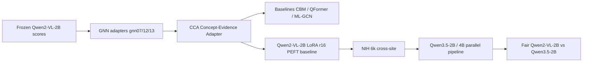

# Final Progress Report — MBZAI Multi-Label CXR Adapters

**Project:** Concept-Evidence Adapters (and related heads) on frozen vision–language models for multi-label chest X-ray classification  
**Repo:** `mbzai`  
**Report date:** 2026-07-12  
**Hardware (latest phase):** 2× RTX 4070 (12 GB)

This document is an end-to-end narrative from the original GNN-adapter work through CCA, Qwen2-VL-2B LoRA, NIH cross-site, and the Qwen3.5-2B/4B campaign. Detailed tables live under `reports/comparison/`; this file is the **story + scoreboard**.

**VLM backends used**

| Backend | Hugging Face id | Size |
|---------|-----------------|-----:|
| **Qwen2-VL-2B** (primary baseline throughout Phases 1–4) | `Qwen/Qwen2-VL-2B-Instruct` | **2B** |
| **Qwen3.5-2B** (fair head-to-head vs Qwen2-VL-2B) | Qwen3.5-2B Instruct variant | **2B** |
| **Qwen3.5-4B** (scaling check; CBM + CCA + frozen done) | Qwen3.5-4B Instruct variant | **4B** |

The fair Qwen2-VL-2B vs Qwen3.5-2B comparison is **2B vs 2B**. Qwen3.5-4B is an extra scale ablation, not the Qwen2 counterpart.

---

## 1. Executive snapshot (where we are now)


| Setting                                          | Best method                     | Test F1 @0.5      | Test AUROC        | Params (trainable) |
| ------------------------------------------------ | ------------------------------- | ----------------- | ----------------- | ------------------ |
| **CheXpert in-domain (Qwen3.5-4B)**              | CBM post-hoc                    | **0.695**         | **0.730**         | 667                |
| **CheXpert in-domain (Qwen3.5-2B)**              | CCA                             | **0.693**         | 0.701             | ~435K              |
| **CheXpert in-domain (Qwen2-VL-2B)**             | CCA (faithful / fair-split row) | 0.674             | 0.666             | ~435K              |
| **CheXpert Optuna leaderboard (Qwen2-VL-2B era)** | CCA LoRA-CLIP trial-27 (5-seed) | **0.701 ± 0.005** | **0.722 ± 0.004** | **118,891**        |
| **NIH cross-site 6k (Qwen3.5-2B)**               | LoRA r16                        | **0.186**         | **0.741**         | ~10.9M             |
| **NIH cross-site 6k (Qwen2-VL-2B)**             | CCA                             | 0.136             | 0.633             | ~119K              |
| **NIH frozen only (Qwen3.5-2B)**                 | Zero-shot VLM                   | **0.147**         | **0.746**         | 0                  |
| **NIH frozen only (Qwen2-VL-2B)**               | Zero-shot VLM                   | 0.059             | 0.524             | 0                  |


**One-line verdict**

- **In-domain CheXpert:** CCA still leads under Qwen3.5-2B; under **Qwen3.5-4B**, tiny **CBM post-hoc (667 params, ~32 s, F1 0.695)** edges CCA (0.690 / 27.5 min).
- **Cross-site NIH:** ranking flips — **Qwen3.5-2B LoRA** is best; Qwen3.5-2B **frozen** alone already beats Qwen2-VL-2B CCA on F1 and crushes Qwen2-VL-2B frozen on AUROC.
- **Backend upgrade:** moving from **Qwen2-VL-2B → Qwen3.5-2B** (same 2B scale) is the largest single lever we have seen (frozen CheXpert F1 **0.047 → 0.456**).

---

## 2. Research arc (how the project evolved)




| Phase                       | Goal                                                      | Outcome                                                                                |
| --------------------------- | --------------------------------------------------------- | -------------------------------------------------------------------------------------- |
| **1. GNN adapters**         | Cheap domain adaptation without VLM fine-tuning           | Bipartite CLIP GNN (`gnn13`) best under leakage-free calib; residual GNN weak at t=0.5 |
| **2. CCA reframing**        | AAAI-style “concept-evidence” story; <1M params           | Optuna trial-27 + LoRA CLIP patches → **best CheXpert F1 in repo**                     |
| **3. Strong PEFT baseline** | Compare CCA to LoRA on the VLM itself                     | Qwen2-VL-2B LoRA-cls **loses** to CCA on CheXpert; SFT path fragile (parse fails)      |
| **4. Cross-site**           | CheXpert-trained → NIH 6k                                 | Domain shift is severe; CCA still best under Qwen2-VL-2B                               |
| **5. Stronger VLM**         | Swap backend to Qwen3.5-2B/4B without clobbering Qwen2-VL-2B | Fair 2B-vs-2B splits; Qwen3.5 wins almost everywhere; LoRA wins NIH                 |


---

## 3. Protocol constants (keep these when reading numbers)


| Item                    | Value                                                                                                  |
| ----------------------- | ------------------------------------------------------------------------------------------------------ |
| VLM backends            | **Qwen2-VL-2B-Instruct** (2B); **Qwen3.5-2B** (2B, fair pair); **Qwen3.5-4B** (4B scaling; frozen/CCA/CBM done) |
| Label space             | 7 CheXpert findings (Atelectasis, Cardiomegaly, Effusion, Pneumonia, Edema, Consolidation, No Finding) |
| Primary metric          | Macro-F1 @ threshold 0.5 (masked)                                                                      |
| Secondary               | Macro AUROC / AUPRC / ECE / Brier; F1 @ per-class thr                                                  |
| CheXpert fair test n    | **9,197** (Qwen2-VL-2B / Qwen3.5-2B shared split protocol)                                             |
| CheXpert 4B fair test n | **9,193** (27 parse failures dropped)                                                                  |
| NIH cross-site          | **6,000** images, seed 42 subset; train only on CheXpert                                               |
| Hardware note           | Dual 4070; WSL used for stable Qwen3.5 fast kernels                                                    |


---

## 4. Phase-by-phase results

### 4.1 Early GNN era (Qwen2-VL-2B frozen)

Frozen zero-shot **Qwen2-VL-2B-Instruct** was **badly calibrated** at t=0.5 (test F1 ≈ **0.047**). Structure + CLIP helped under a **leakage-free 4-way** protocol:


| Model               | Calibrated test macro-F1 (approx., from README snapshot) |
| ------------------- | -------------------------------------------------------- |
| MLP                 | 0.654                                                    |
| GNN07 residual      | ~0.65 (near MLP when calibrated; collapses at naive 0.5) |
| GNN12 CLIP+VLM homo | 0.678                                                    |
| GNN13 bipartite     | **0.689**                                                |


**Up:** Clear story that “frozen VLM + small adapter” beats full fine-tuning cost.  
**Down:** Naive t=0.5 evaluation was misleading; threshold leakage could invent tens of F1 points. Residual label-graph alone was not a win at fixed 0.5.

---

### 4.2 CCA era (CheXpert, Qwen2-VL-2B scores)

Reframe: Concept-Evidence Adapter with CLIP patches + VLM residual + optional faithfulness gate.


| Result              | Value                                              |
| ------------------- | -------------------------------------------------- |
| Best config         | `cca_lora_r8_trial27` (LoRA CLIP r=8, Optuna arch) |
| Test F1 (5-seed)    | **0.701 ± 0.005**                                  |
| Test AUROC (5-seed) | **0.722 ± 0.004**                                  |
| Trainable params    | **118,891**                                        |
| vs QFormer          | +0.025 F1, +0.014 AUROC                            |


| Finding  | Detail                                                                                       |
| -------- | -------------------------------------------------------------------------------------------- |
| **Up**   | Hit AAAI-style <1M param target; stable multi-seed; beat QFormer / CBM / ML-GCN              |
| **Down** | Explicit RadGraph / concept prior **hurt** F1; best F1 config **disables** faithfulness gate |
| **Down** | Default CCA (~435K, gate on) is solid but below Optuna LoRA-CLIP peak                        |


Sources: `docs/combined_experiments_report.md`, `reports/comparison/cca_optuna_summary.md`.

---

### 4.3 Qwen2-VL-2B LoRA as PEFT baseline


| Model                                 | CheXpert Test F1 | AUROC | Params | Note                                                    |
| ------------------------------------- | ---------------- | ----- | ------ | ------------------------------------------------------- |
| CCA trial-27 (seed 0)                 | **0.707**        | 0.717 | 119K   | Reference                                               |
| LoRA-16 + cls (`qwen2vl_lora_r16_v2`) | 0.582            | 0.685 | 18.5M  | Primary PEFT baseline on **Qwen2-VL-2B**                |
| LoRA-16 + JSON SFT (`…_sft_v3`)       | 0.655            | 0.500 | 18.5M  | **Parse fail ≈ all test** — AUROC collapsed             |


**Up:** Established a fair “expensive PEFT” comparator; CCA is ~0.64% of LoRA trainable params.  
**Down:** JSON SFT for Qwen2-VL-2B was operationally painful (parse failures). Cls-head LoRA still **well below** CCA on F1 (−0.12).  
**Cross-site (Qwen2-VL-2B):** LoRA 0.114 F1 < CCA 0.136 F1 — adapter still better under Qwen2-VL-2B shift.

---

### 4.4 NIH cross-site under Qwen2-VL-2B (6k)

Train CheXpert → test NIH subset (no NIH fine-tuning).


| Model                     | F1 @0.5   | AUROC      |
| ------------------------- | --------- | ---------- |
| Frozen VLM                | 0.059     | 0.524      |
| CBM post-hoc / label-free | ~0.05     | ~0.49–0.54 |
| ML-GCN                    | 0.086     | 0.544      |
| QFormer                   | 0.132     | 0.643      |
| CCA                       | **0.136** | 0.633      |
| Qwen2-VL-2B LoRA r16      | 0.114     | 0.612      |


**Up:** Cross-site pipeline and reporting solidified (`run_crosssite_nih.py`).  
**Down:** Absolute F1 is low; domain shift dominates. Frozen Qwen2-VL-2B is near chance AUROC.

---

### 4.5 Qwen3.5 campaign (fair vs Qwen2-VL-2B)

**Design rules that mattered**

- Parallel artifact paths (`outputs_vlm_qwen35_*`, `splits_qwen35_*`, protocols `qwen35_2b` / `qwen35_4b`) so Qwen2-VL-2B runs are never overwritten.
- Fair CheXpert comparison: **same patient splits**; inject Qwen3.5 VLM scores into Qwen2-VL-2B path/label protocol (`qwen35_qwen2_splits`).
- Same NIH 6k image list; only VLM scores differ for frozen/CBM/CCA.
- **Matched scale for the main comparison:** Qwen2-VL-**2B** vs Qwen3.5-**2B**; Qwen3.5-**4B** is optional scaling only.

#### CheXpert — macro F1 @0.5


| Method         | Qwen2-VL-2B | Qwen3.5-2B | Δ     | Qwen3.5-4B |
| -------------- | ----------- | ---------- | ----- | ---------- |
| Frozen VLM     | 0.047       | **0.456**  | +0.41 | **0.564**  |
| CBM post-hoc   | 0.621       | 0.662      | +0.04 | **0.695**  |
| CBM label-free | 0.476       | **0.660**  | +0.18 | 0.409      |
| CCA            | 0.674       | **0.693**  | +0.02 | 0.690      |
| LoRA r16       | 0.582       | **0.661**  | +0.08 | —          |


#### CheXpert — macro AUROC


| Method       | Qwen2-VL-2B | Qwen3.5-2B | Qwen3.5-4B |
| ------------ | ----------- | ---------- | ---------- |
| Frozen       | 0.492       | 0.670      | **0.698**  |
| CBM post-hoc | 0.542       | 0.716      | **0.730**  |
| CBM label-free | **0.616** | 0.614      | 0.615      |
| CCA          | 0.666       | 0.701      | **0.730**  |
| LoRA         | 0.685       | **0.757**  | —          |


**2B → 4B scaling (updated 2026-07-12):** frozen F1 **+0.108**; **CBM post-hoc F1 +0.033** (0.662 → **0.695**) and becomes the **best 4B CheXpert method**, edging CCA (0.690) with only **667** params; CCA F1 stays ~tied (~0.69) while AUROC/calibration improve. Label-free CBM F1@0.5 **drops** on 4B (0.660 → 0.409) while AUROC stays ~0.615 — ranking quality unchanged; thresholded F1 is fragile for this CLIP-only head.

#### Qwen3.5-4B CBM runs (CheXpert fair splits, test n=9,193)

Trained 2026-07-12 with the existing CBM scripts on `qwen35_4b_qwen2_splits` (no new trainer code). Wall-clock on 1× RTX 4070 (`gpu_id 0`), including data load / CLIP encode where applicable.

| Method | Val F1 | Test F1 | Test AUROC | Test AUPRC | ECE | Brier | Params | Train time | Run id |
|--------|-------:|--------:|-----------:|-----------:|----:|------:|-------:|-----------:|--------|
| CBM post-hoc | 0.700 | **0.695** | **0.730** | 0.629 | 0.099 | 0.168 | 667 | **32 s** | `cbm_posthoc/qwen35_4b_qwen2_splits/cbm_posthoc_qwen35_4b_qwen2_splits` |
| CBM label-free | 0.430 | 0.409 | 0.615 | 0.526 | 0.116 | 0.212 | 217 | **9.2 min** (552 s) | `cbm_labelfree/qwen35_4b_qwen2_splits/cbm_labelfree_qwen35_4b_qwen2_splits` |

Label-free time is dominated by CLIP concept encoding over train/val/test images; the linear head itself is cheap after features are cached in memory.

Commands:

```bash
python scripts/15_train_posthoc_cbm.py ... --protocol qwen35_4b_qwen2_splits --run_id cbm_posthoc_qwen35_4b_qwen2_splits
python scripts/16_train_labelfree_cbm.py ... --protocol qwen35_4b_qwen2_splits --run_id cbm_labelfree_qwen35_4b_qwen2_splits
```

**4B CBM takeaways**

1. **Post-hoc CBM scales cleanly with better VLM scores** — best CheXpert F1 so far for the 4B backend, only 667 trainable params, and **~32 s** wall-clock.
2. **Label-free CBM is CLIP-driven**, so it does not automatically inherit VLM scale; F1@0.5 can move a lot while AUROC stays flat (~0.615 across Qwen2 / 3.5-2B / 3.5-4B). Wall-clock **~9.2 min**, mostly CLIP encode.
3. **Still pending for 4B:** LoRA r16 + NIH cross-site.

#### NIH 6k — macro F1 @0.5


| Method         | Qwen2-VL-2B | Qwen3.5-2B | Δ      |
| -------------- | ----------- | ---------- | ------ |
| Frozen VLM     | 0.059       | **0.147**  | +0.088 |
| CBM post-hoc   | 0.053       | **0.135**  | +0.082 |
| CBM label-free | 0.052       | **0.087**  | +0.035 |
| CCA            | **0.136**   | 0.133      | ~0     |
| LoRA r16       | 0.114       | **0.186**  | +0.072 |


#### NIH 6k — macro AUROC


| Method | Qwen2-VL-2B | Qwen3.5-2B | Δ      |
| ------ | ----------- | ---------- | ------ |
| Frozen | 0.524       | **0.746**  | +0.222 |
| LoRA   | 0.612       | **0.741**  | +0.129 |
| CCA    | 0.633       | 0.630      | ~0     |


**Ranking flip (important):** on NIH under Qwen3.5-2B, **LoRA > Frozen > CCA**, opposite of CheXpert where **CCA ≥ LoRA ≫ Frozen (Qwen2-VL-2B)**.

Canonical frozen NIH run: `vlm_zeroshot/nih/qwen35_2b_frozen_nih_n6000`  
(F1 **0.1471**, AUROC **0.7455**, AUPRC **0.1315**, ECE **0.0992**, Brier **0.0813**).

---

## 5. Ups and downs (honest engineering + science log)

### Ups

1. **CCA efficiency story held** on CheXpert: best F1 with ≪ LoRA params (Optuna 119K; fair-split CCA ~435K still beats LoRA on F1).
2. **Qwen3.5 backend upgrade** is unambiguously positive for frozen quality and for most adapters.
3. **Fair comparison discipline** (shared splits / shared NIH paths) made Qwen2-VL-2B vs Qwen3.5-2B claims credible.
4. **Cross-site LoRA win under Qwen3.5-2B** shows PEFT can transfer when the base VLM is strong enough.
5. **Dual-GPU + WSL path** eventually made NIH 6k frozen scoring practical (~2.1 s/image after warmup).
6. **Artifact isolation** (`model_id` + `protocol`) prevented clobbering months of Qwen2-VL-2B results.

### Downs / failures

1. **Frozen Qwen2-VL-2B at t=0.5** looks useless (F1 ~0.05) — easy to misread without calibration protocol.
2. **GNN07 at naive 0.5** near-zero F1; only fair with calib thresholds.
3. **Faithfulness / RadGraph priors** did not deliver the hoped F1 gains on the winning CCA configs.
4. **Qwen2-VL-2B JSON SFT LoRA** — catastrophic parse failures on test; AUROC collapsed to chance.
5. **NIH under Qwen2-VL-2B** — absolute performance remains weak; CCA “wins” among weak options.
6. **Qwen3.5 scoring pitfalls**
  - `max_new_tokens` too small → truncated JSON → mass `parse_failed` → empty align.
  - Qwen3.5-4B **thinking/reasoning** spam until `enable_thinking=False`.
  - Windows + `causal-conv1d` / flash kernels fragile; temporary CPU-torch breakage in venv.
7. **CCA does not inherit Qwen3.5’s NIH AUROC leap** — F1/AUROC ~tied with Qwen2-VL-2B CCA; adapter may be saturating or overfit to CheXpert residual patterns.
8. **4B still incomplete for LoRA / NIH** — CheXpert frozen + CCA + **both CBMs** done; LoRA and NIH cross-site for 4B still pending.
9. **Metric bookkeeping** — some NIH `metrics.json` omitted AUROC (NaN); had to recompute from predictions / re-score frozen run.
10. **4B label-free CBM F1 drop** (0.660 → 0.409) despite flat AUROC — do not over-read F1@0.5 for CLIP-only heads across slightly different fair splits.

### Neutral / nuanced

- CBM label-free: huge CheXpert F1 jump with Qwen3.5, but AUROC ~flat — threshold effects, not pure ranking gains.
- On NIH, CBM label-free calibration (ECE/Brier) **worsens** slightly under Qwen3.5 despite F1 gain.

---

## 6. Parameter / cost picture (params **and** train time)

Train time is a first-class cost metric alongside params. Sources: LoRA `metrics.json` `gpu_hours`; CCA `train.log` `elapsed_min`; CBM/MLGCN/MLP/QFormer wall-clock on **1× RTX 4070** (2026-07-12). Machine-readable: [`reports/comparison/train_time_summary.json`](reports/comparison/train_time_summary.json).

### CheXpert adapter cost leaderboard

| Method | Backend | Test F1 @0.5 | Params | Train time | Peak VRAM | Source |
|--------|---------|-------------:|-------:|-----------:|----------:|--------|
| Frozen VLM | Qwen3.5-4B | 0.564 | 0 | **0** (no train) | — | scoring only |
| VLM MLP | Qwen2-VL-2B | ~0.53† | tiny | **~3 s** | low | timed 4070 |
| ML-GCN | Qwen2-VL-2B | 0.470 | 8,577 | **~21 s** | low | timed 4070 (25 ep) |
| CBM post-hoc | Qwen3.5-2B | 0.662 | 667 | **~27 s** | low | timed 4070 |
| CBM post-hoc | Qwen3.5-4B | **0.695** | 667 | **~32 s** | low | original run |
| CBM label-free | Qwen3.5-4B | 0.409 | 217 | **~9.2 min** | CLIP | original run (encode-bound) |
| CBM label-free | Qwen2 / Qwen3.5-2B | 0.476 / 0.660 | 217 | **~9 min (est.)** | CLIP | same encode bound as 4B |
| CCA (fair default) | Qwen3.5-2B | 0.693 | 435,261 | **8.0 min** | mid | `train.log` |
| CCA (fair default) | Qwen3.5-4B | 0.690 | 435,261 | **27.5 min** | mid | `train.log` (60 ep) |
| CCA Optuna trial-27 | Qwen2-VL-2B | **0.707** | **118,891** | **~5–15 min** | mid | docs (RTX 4060) |
| QFormer | Qwen2-VL-2B | 0.676 | 263,815 | **~15.8 min** | mid | timed 4070‡ |
| LoRA r16 cls | Qwen2-VL-2B | 0.582 | 18,475,527 | **3.37 GPU-h (~3h 22m)** | ~8.7 GB | `metrics.json` |
| LoRA r16 SFT | Qwen2-VL-2B | 0.655§ | 18,464,768 | **16.06 GPU-h (~16h)** | ~8.8 GB | `metrics.json` |
| LoRA r16 cls | Qwen3.5-2B | 0.661 | 10,926,087 | **15.76 GPU-h (~15h 46m)** | ~8.6 GB | `metrics.json` |

† MLP F1 varies by seed/run; timing re-run used default splits.  
‡ QFormer timing includes first-time ViT patch encode for the `timing` protocol cache. CCA times above are **train-only** with patches already cached.  
§ SFT F1 inflated vs broken AUROC (parse failures).

### Cost takeaways

1. **CBM post-hoc is the efficiency extreme** — best/near-best F1 under Qwen3.5-4B with **667 params** and **~30 s** train.
2. **CCA is still cheap** — minutes, not hours; Optuna trial-27 (~119K params) is the classic Qwen2 CheXpert winner.
3. **LoRA is 10²–10³× slower** than CCA/CBM on wall-clock (hours vs seconds/minutes) and ~25–150× more trainable params.
4. **Label-free CBM train time ≈ CLIP encode**, not the linear head — budget ~9 min whenever features are rebuilt.
5. **QFormer** sits between CCA and LoRA on time (~16 min) with mid-size params (~264K).

**Efficiency claim that still stands:** on CheXpert, CCA/CBM deliver competitive or better F1 than VLM LoRA at **≪1%** of LoRA’s trainable params and **≪5%** of LoRA’s GPU-hours.

---

## 7. What is done vs pending

### Done

- GNN family + calibrated protocol
- CCA Optuna, multi-seed, faithfulness/prior ablations
- CBM / QFormer / ML-GCN baselines (Qwen2-VL-2B)
- Qwen2-VL-2B LoRA cls (+ attempted SFT)
- NIH 6k cross-site under Qwen2-VL-2B (full method table)
- Qwen3.5-2B parallel scoring / LoRA / fair CheXpert + NIH for 5 methods
- Qwen3.5-4B CheXpert frozen + CCA (fair splits)
- **Qwen3.5-4B CheXpert CBM post-hoc + label-free** (post-hoc test F1 **0.695**)
- Reports refreshed (`reports/comparison/qwen2_vs_qwen35_*.md`, `crosssite_nih.md`)

### Pending / next

- Qwen3.5-4B: LoRA on fair CheXpert splits
- Qwen3.5-4B: full NIH 6k frozen + adapter cross-site
- Re-run Optuna-style CCA (trial-27 LoRA-CLIP) on **Qwen3.5** scores (may reclaim CheXpert peak under new backend)
- Optional: VQA / report generation track (`vlm_report_vqa_plan.md`) — separate from classification adapters
- Paper packaging: fold Qwen3.5 / 4B CBM tables into `docs/academic_report.md` / AAAI draft
- Refresh `reports/comparison/qwen2_vs_qwen35_chexpert.md` with 4B CBM rows

---

## 8. Key takeaways for the paper / next talk

1. **Adapter thesis (CheXpert):** A small concept-evidence adapter (or even post-hoc CBM) on frozen VLM scores can beat expensive VLM LoRA on F1 while using ≪1% of the trainable parameters **and minutes instead of hours** of GPU time.
2. **Backend thesis:** Upgrading the frozen VLM (**Qwen2-VL-2B → Qwen3.5-2B**, same 2B scale) dominates most adapter gains; ignore this and you underestimate zero-shot and CBM ceilings.
3. **Generalization thesis:** Under strong VLMs, **PEFT LoRA can win cross-site** even when CCA wins in-domain — do not claim a single ranking across settings.
4. **Calibration thesis:** Always report AUROC/ECE alongside F1@0.5; Qwen2-VL-2B frozen F1 is not the right first impression of model quality.
5. **Engineering thesis:** Multi-VLM work needs hard path isolation (`protocol` + dedicated outputs) or you will silently overwrite baselines.
6. **4B CBM thesis:** With stronger VLM scores, **post-hoc CBM (667 params, ~32 s)** can match or beat CCA on CheXpert F1; label-free (CLIP-only) should be judged on AUROC, not only F1@0.5.
7. **Cost thesis:** Always report **train time + params** — LoRA’s 3–16 GPU-hours vs CCA’s ~8–28 min vs CBM’s ~30 s is as important as the F1 delta.

---

## 9. Pointers to detailed artifacts


| Document                                                                                           | Contents                                                         |
| -------------------------------------------------------------------------------------------------- | ---------------------------------------------------------------- |
| `[reports/comparison/qwen2_vs_qwen35_summary.md](reports/comparison/qwen2_vs_qwen35_summary.md)`   | Short Qwen2 vs Qwen3.5 scoreboard                                |
| `[reports/comparison/qwen2_vs_qwen35_chexpert.md](reports/comparison/qwen2_vs_qwen35_chexpert.md)` | Full CheXpert + NIH head-to-head                                 |
| `[reports/comparison/crosssite_nih.md](reports/comparison/crosssite_nih.md)`                       | NIH Qwen2 table + Qwen3.5 frozen highlight                       |
| `[reports/comparison/lora16_vs_cca.md](reports/comparison/lora16_vs_cca.md)`                       | Qwen2 LoRA vs CCA                                                |
| `[docs/combined_experiments_report.md](docs/combined_experiments_report.md)`                       | CCA Optuna / seeds / ablations (May 2026)                        |
| `[docs/academic_report.md](docs/academic_report.md)`                                               | Paper-style methods + GNN narrative                              |
| `[reports/comparison/train_time_summary.json](reports/comparison/train_time_summary.json)`         | Params + train-time cost table (JSON)                            |
| `[reports/comparison/train_time_bench.jsonl](reports/comparison/train_time_bench.jsonl)`           | Raw 4070 wall-clock re-timing log                                |
| Metrics JSON                                                                                       | `reports/comparison/qwen2_vs_qwen35_{chexpert,nih}_metrics.json` |


---

## 10. Bottom line

We started with **frozen Qwen2-VL-2B + tiny structured adapters**, proved that **CCA** is a strong, parameter-efficient CheXpert solution, then stress-tested it against **VLM LoRA** and **NIH shift**. The latest chapter shows that **Qwen3.5-2B** (same parameter class as Qwen2-VL-2B) **massively raises the frozen baseline** and **changes which method wins off-site**, while CCA remains the **in-domain efficiency champion at 2B**. On **Qwen3.5-4B**, **CBM post-hoc (F1 0.695, 667 params)** currently leads the fair CheXpert table over CCA (0.690). Remaining gap: **4B LoRA** and **4B NIH**, plus whether Optuna-CCA on Qwen3.5 scores can reclaim a new peak without giving up the <1M-param story.