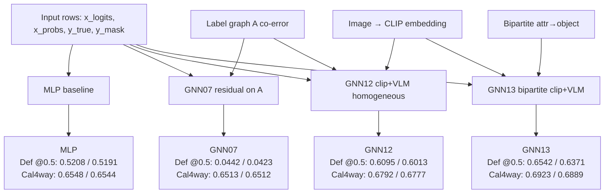

# MBZAI: Multi-Label Chest X-ray Baselines and GNN Adapters

**Paper-style reference (methods, protocols, citations, full result narrative):** [`docs/academic_report.md`](docs/academic_report.md). **Machine-readable summaries:** [`reports/comparison/overall.md`](reports/comparison/overall.md) and [`reports/comparison/overall.json`](reports/comparison/overall.json). **LaTeX/PDF:** `bash scripts/build_academic_report_pdf.sh` → [`docs/academic_report.tex`](docs/academic_report.tex) + [`docs/academic_report.pdf`](docs/academic_report.pdf) (Pandoc, **XeLaTeX** by default, `PDF_ENGINE=…` to override).

The diagram below snapshots **macro-F1** aligned with **`repro_full_20260503`** in `overall.md`; if your splits, VLM shards, or `RUN_ID` differ, treat `metrics.json` and the packaged report as source of truth.

This repository compares multi-label adapters on CheXpert-style rows using frozen **Qwen2-VL** scores \((z,p)\):

- Frozen VLM (`vlm_zeroshot`)
- MLP on VLM logits/probs (`vlm_mlp`)
- Residual label-graph GNN (`gnn07_label_residual`)
- CLIP + VLM homogeneous label GNN (`gnn12_clip_vlm_homo`)
- CLIP object + VLM attribute bipartite GNN (`gnn13_clip_bipartite`)

## Canonical model IDs

- `vlm_zeroshot` (`VLMZeroShot`): frozen VLM outputs used directly (no adapter head).
- `vlm_mlp` (`VLMFeatureMLP`): MLP adapter over `(x_logits, x_probs)`.
- `gnn07_label_residual` (`LabelGraphResidualGNN`): residual message passing on co-error adjacency \(A\).
- `gnn12_clip_vlm_homo` (`ClipVlmHomogeneousGNN`): CLIP embedding + homogeneous label graph.
- `gnn13_clip_bipartite` (`ClipBipartiteAttributeGNN`): bipartite attribute→object (NativeGNN).

## Variant architecture diagram

Macro-F1 captions: **default** split @0.5 (val/test) and **calibrated4way** val/test (`per_class_thresholds.json` tuned on `calib` only; evaluated on val/test).



## What this repo contains

- Data preparation and splits (`scripts/01`–`04`, including `03_make_multilabel_splits_4way.py`)
- Baselines (`scripts/05_run_baseline_frozen_vlm.py`, `scripts/06_run_baseline_mlp.py`)
- GNN training (`07`, `12`, `13`)
- Thresholding and eval (`08`, `09`), ablation helper (`10`), reporting (`11`)
- Optional Gradio UI (`gradio_inference.py`)

## Environment setup

1. Python **3.10+** recommended.
2. Install dependencies:

```bash
pip install -r requirements.txt
```

Notes:

- Training scripts expect a **CUDA** PyTorch build (`requirements.txt` uses the CUDA 12.1 wheel index).
- Full reproduction assumes a project **venv** at `.venv/` (see `scripts/reproduce_all_results.sh`).
- Invoke scripts with **`python3`** from your env, or `.venv/bin/python` when using the reproduction script verbatim.

## Data expectations

Configured in `configs/data.yaml`:

- `train_csv` / `valid_csv`: e.g. `data/raw/train.csv`, `data/raw/valid.csv`
- `vlm_dir`: aligned VLM JSONL output (consumed by `02_align_vlm_outputs.py`)

CheXpert-style finding columns:

- `1`: positive · `0`: negative · `-1`: uncertain · empty: ignore (mask 0 after policy)

## Reproduce all results (recommended)

From repo root (GPU id via `GPU=0`; run id defaults to timestamped):

```bash
bash scripts/reproduce_all_results.sh
```

This script:

1. Builds **canonical labels**, aligned rows, **`default`** and **`calibrated4way`** splits.
2. Builds **two co-error graphs**: `data/processed/graph/` (3-way train) and `data/processed/graph_4way/` (`train_fit` from 4-way).
3. Maintains **separate CLIP caches** (`do not mix row orders`):  
   `data/processed/embeddings/clip_vitb32_default.pt` and `clip_vitb32_calibrated4way.pt` (override with `CLIP_CACHE_DEFAULT` / `CLIP_CACHE_4WAY`).
4. Trains/evals **every** model id under both protocols, writes `calib`-fed `*_metrics_calibrated.json`, runs `11_package_report.py`.

For a pinned report bundle matching the docs, pick a stable `RUN_ID` (example: `RUN_ID=repro_full_20260503 bash scripts/reproduce_all_results.sh`).

## Minimal manual pipeline (incremental)

If you iterate step-by-step without the bash driver:

```bash
python3 scripts/01_build_canonical_labels.py
python3 scripts/02_align_vlm_outputs.py
python3 scripts/03_make_multilabel_splits.py
python3 scripts/03_make_multilabel_splits_4way.py
python3 scripts/04_build_coerror_graph.py --train_rows_json data/processed/splits/train_rows.json --out_dir data/processed/graph
python3 scripts/04_build_coerror_graph.py --train_rows_json data/processed/splits_4way/train_fit_rows.json --out_dir data/processed/graph_4way
# … then baselines 05–07, CLIP GNN 12–13, 08–09 calibration, and 11_package_report.py
```

## Organized training entry points

Model wrappers (delegating to numbered scripts):

- `scripts/models/vlm_zeroshot/run_default.py`
- `scripts/models/vlm_mlp/train.py`
- `scripts/models/gnn07_label_residual/train.py`
- `scripts/models/gnn12_clip_vlm_homo/train.py`
- `scripts/models/gnn13_clip_bipartite/train.py`

Common CLI:

- `--model_id`
- `--protocol` (`default` | `calibrated4way`)
- `--run_id` (optional)
- `--resume_from` (training only)

Example (calibrated 4-way, new run):

```bash
python3 scripts/models/gnn13_clip_bipartite/train.py \
  --protocol calibrated4way \
  --run_id my_sweep \
  --train_rows_json data/processed/splits_4way/train_fit_rows.json \
  --val_rows_json data/processed/splits_4way/val_rows.json \
  --test_rows_json data/processed/splits_4way/test_rows.json \
  --calib_rows_json data/processed/splits_4way/calib_rows.json
```

Shortcut to launch all GNN variants (project-specific defaults):

```bash
bash scripts/run_all_gnn_variants.sh
```

## Main output locations

- Run dirs: `data/processed/experiments/<model_id>/<protocol>/<run_id>/…`  
  (checkpoints such as `best_checkpoint.pt`, `val_predictions.json`, `*_metrics_calibrated.json`, …)
- Pointers: `runs_index.json`, `latest.json`, `best.json` under each `<model_id>/<protocol>/`.
- Packaged summaries:  
  `reports/gnn_adapter/report.md`, **`reports/comparison/overall.{md,json}`** (`python3 scripts/11_package_report.py`).

Older runs may live under **`data/processed/experiments/_archive_*/`**; active training should populate the non-archive tree first.

## Metric interpretation

- **Never** compare `@0.5` macro-F1 on frozen logits with **calibrated** macro-F1 on the same prose table without labeling them—they answer different operating-point questions.
- **Calibrated4way:** thresholds tuned **only** on `calib`, frozen for val/test (see **`docs/metrics.md`** and **§6.2** of `docs/academic_report.md` for leaky val-tuned paths `*_LEAKY.json`).
- Zeroshot **`calibrated4way`** macro-F1 uses exported **`x_probs`** + the same calibration rule as adapters—not raw `@0.5` on logits.

## Inference app

```bash
python3 gradio_inference.py
```

Adapter weights resolve from **`data/processed/experiments/<model_id>/<protocol>/best.json`** (current `run_dir`) **before** any `_archive_*` fallbacks; per-class thresholds prefer **`calibrated4way`** `per_class_thresholds.json`.

## Additional documentation

- Canonical narrative: **`docs/academic_report.md`**
- Config / script wiring: **`docs/pipeline.md`**
- Metrics and fair comparison: **`docs/metrics.md`**
