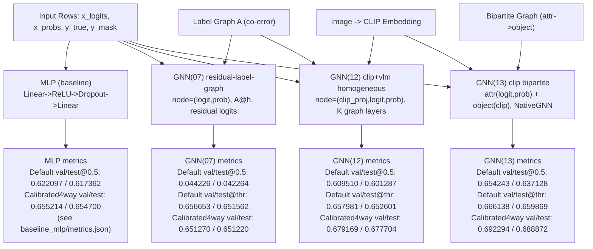

# MBZAI: Multi-Label Chest X-ray Baselines and GNN Adapters

**Academic reference (methods, protocols, citations, full result table):** [`docs/academic_report.md`](docs/academic_report.md). Use that file as the canonical write-up; the diagram below is a short snapshot and may not match your local `metrics.json` if checkpoints or splits differ.

This repository builds a multi-label classification pipeline over CheXpert-style data and compares:
- frozen VLM baseline
- MLP baseline over VLM outputs
- GNN adapter variants over label structure

## Canonical Model IDs

- `vlm_zeroshot` (`VLMZeroShot`): frozen VLM outputs used directly (no adapter head)
- `vlm_mlp` (`VLMFeatureMLP`): MLP adapter over `(x_logits, x_probs)`
- `gnn07_label_residual` (`LabelGraphResidualGNN`): residual label-graph GNN
- `gnn12_clip_vlm_homo` (`ClipVlmHomogeneousGNN`): CLIP + VLM homogeneous label-graph GNN
- `gnn13_clip_bipartite` (`ClipBipartiteAttributeGNN`): CLIP object + VLM attribute bipartite GNN

## Variant Architecture Diagram



## What This Repo Contains

- Data preparation and split building (`scripts/01` to `scripts/04`)
- Baselines (`scripts/05_run_baseline_frozen_vlm.py`, `scripts/06_run_baseline_mlp.py`)
- GNN training (`scripts/07_train_gnn_adapter.py`, `scripts/12_train_clip_vlm_gnn_adapter.py`, `scripts/13_train_bipartite_gnn_adapter.py`)
- Evaluation and reporting (`scripts/08` to `scripts/11`)
- Inference UI (`gradio_inference.py`)

## Environment Setup

1. Create and activate a Python environment (3.10+ recommended).
2. Install dependencies:

```bash
pip install -r requirements.txt
```

Notes:
- Training scripts are GPU-only and require CUDA-enabled PyTorch.
- `requirements.txt` already points to the CUDA 12.1 PyTorch index.

## Data Expectations

Key inputs are configured in `configs/data.yaml`:
- `train_csv`: `data/raw/train.csv`
- `valid_csv`: `data/raw/valid.csv`
- `vlm_dir`: VLM output directory
- `label_order`: canonical label order used across pipeline

Label semantics in CheXpert-style columns:
- `1`: positive
- `0`: negative
- `-1`: uncertain
- empty: not mentioned / unlabeled

## End-to-End Pipeline

Run these in order from repo root:

```bash
python scripts/01_build_canonical_labels.py
python scripts/02_align_vlm_outputs.py
python scripts/03_make_multilabel_splits.py
python scripts/04_build_coerror_graph.py
python scripts/05_run_baseline_frozen_vlm.py
python scripts/06_run_baseline_mlp.py
python scripts/07_train_gnn_adapter.py
python scripts/08_tune_thresholds.py
python scripts/09_evaluate_test.py
python scripts/10_run_ablations.py
python scripts/11_package_report.py
```

## Organized Training Entry Points

Model wrappers (backward-compatible with existing scripts):

- `scripts/models/vlm_zeroshot/run_default.py`
- `scripts/models/vlm_mlp/train.py`
- `scripts/models/gnn07_label_residual/train.py`
- `scripts/models/gnn12_clip_vlm_homo/train.py`
- `scripts/models/gnn13_clip_bipartite/train.py`

Each training/eval script now supports:
- `--model_id`
- `--protocol` (`default` or `calibrated4way`)
- `--run_id` (optional, auto-generated if omitted)
- `--resume_from` (training scripts only)

Example (new run):

```bash
python scripts/models/gnn13_clip_bipartite/train.py \
  --protocol calibrated4way \
  --run_id hp_sweep_lr3e4 \
  --train_rows_json data/processed/splits_4way/train_fit_rows.json \
  --val_rows_json data/processed/splits_4way/val_rows.json \
  --test_rows_json data/processed/splits_4way/test_rows.json \
  --calib_rows_json data/processed/splits_4way/calib_rows.json
```

Example (retrain/resume):

```bash
python scripts/models/gnn13_clip_bipartite/train.py \
  --protocol calibrated4way \
  --run_id retrain_from_prev \
  --resume_from data/processed/experiments/gnn13_clip_bipartite/calibrated4way/<old_run_id>/best_checkpoint.pt
```

Run all GNN variants quickly:

```bash
bash scripts/run_all_gnn_variants.sh
```

## Main Output Locations

- Organized run outputs:
  - `data/processed/experiments/<model_id>/<protocol>/<run_id>/...`
- Run registry and pointers:
  - `data/processed/experiments/<model_id>/<protocol>/runs_index.json`
  - `data/processed/experiments/<model_id>/<protocol>/latest.json`
  - `data/processed/experiments/<model_id>/<protocol>/best.json`
- Reports:
  - `reports/gnn_adapter/report.md` (legacy-compatible output)
  - `reports/comparison/overall.md` (global comparison output)

## Metric Interpretation (Important)

When comparing MLP vs GNN, do not mix:
- fixed-threshold scores (typically `@0.5`)
- per-class tuned-threshold scores

Per-class thresholds tuned on validation can inflate validation F1 if reused on the same split. Keep comparisons consistent:
- fixed vs fixed, or
- tuned vs tuned with identical calibration protocol

Detailed guidance: `docs/metrics.md`.

## Inference App

Run:

```bash
python gradio_inference.py
```

The app uses trained artifacts under `data/processed/experiments/...` and associated config/settings.

## Additional Documentation

- **Paper-style report (canonical):** `docs/academic_report.md`
- Pipeline details and config mapping: `docs/pipeline.md`
- Metrics and fair-comparison protocol: `docs/metrics.md`
