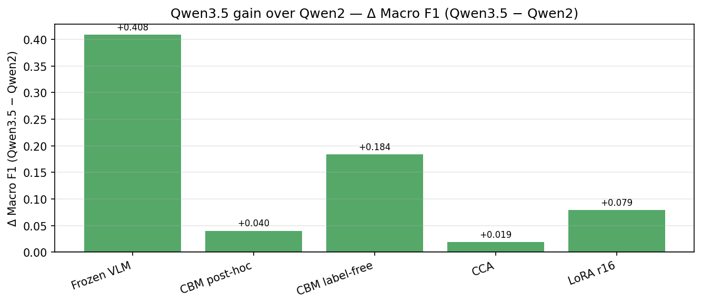
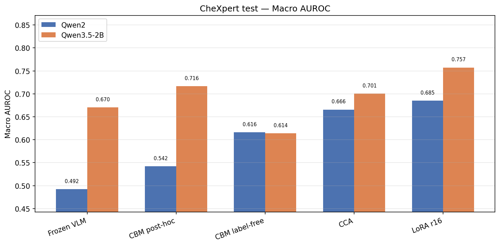
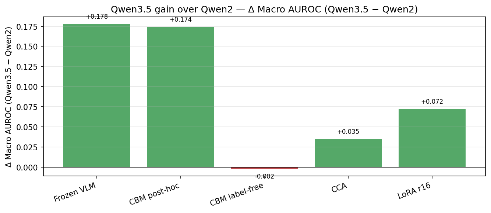
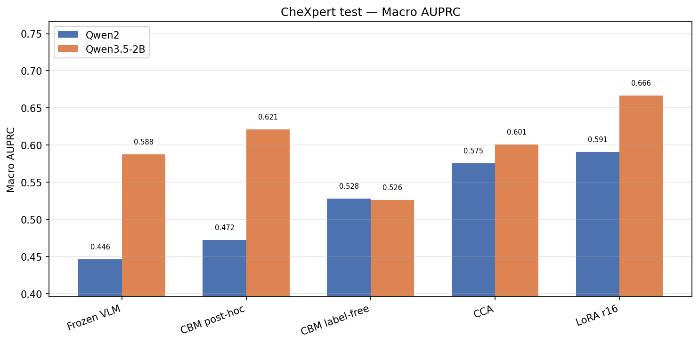
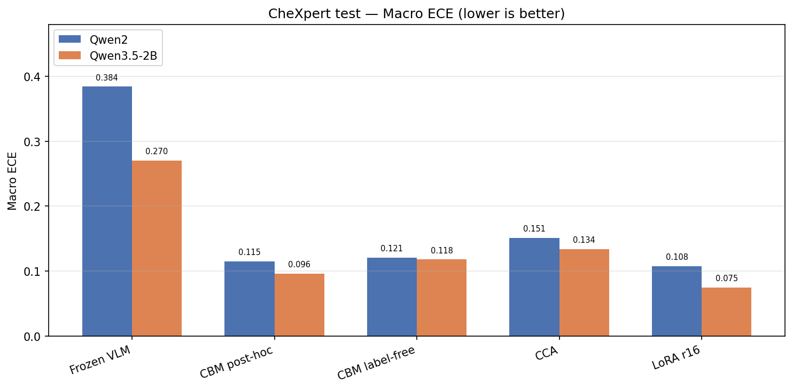
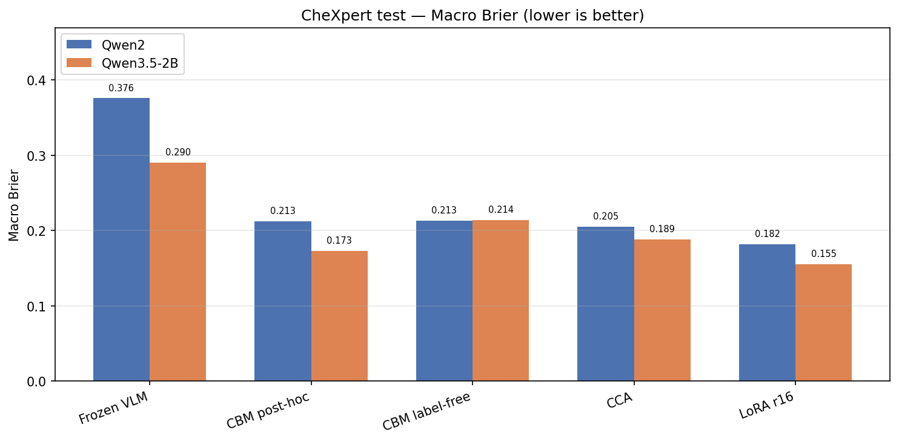

# Qwen2-VL vs Qwen3.5-2B — CheXpert & NIH Head-to-Head

Fair comparison on the **same CheXpert splits** (Qwen2 path/label protocol; Qwen3.5 VLM scores injected via `qwen35_qwen2_splits`) and the **same NIH 6k cross-site set** (identical image paths/labels; VLM scores differ for Qwen3.5).

| Dataset | Test n | Train |
|---------|-------:|-------|
| CheXpert in-domain | 9,197 | CheXpert train split |
| NIH cross-site | 6,000 | CheXpert-trained models only (no NIH fine-tuning) |

**Metrics sources:** [`qwen2_vs_qwen35_chexpert_metrics.json`](qwen2_vs_qwen35_chexpert_metrics.json) · [`qwen2_vs_qwen35_nih_metrics.json`](qwen2_vs_qwen35_nih_metrics.json)  
**Simplified summary:** [`qwen2_vs_qwen35_summary.md`](qwen2_vs_qwen35_summary.md)  
**Collect:** `scripts/compare_qwen2_qwen35_chexpert.py` · `scripts/collect_qwen35_nih_metrics.py`  
**Plots:** `scripts/plot_qwen2_vs_qwen35_chexpert.py`

**Completion status:** All 5 methods evaluated on CheXpert (n=9,197) and NIH (n=6,000). Qwen3.5 LoRA NIH cross-site confirmed — 6,000 predictions in `qwen35_2b_lora_r16/nih/crosssite_eval_qwen35_2b`.

---

# Part A — CheXpert in-domain (n = 9,197)

## Overview


---

## Test macro F1 @0.5

| Method | Qwen2-VL | Qwen3.5-2B | Δ (3.5 − 2) | Winner |
|--------|---------:|-----------:|------------:|--------|
| Frozen VLM | 0.047 | **0.456** | +0.409 | Qwen3.5 |
| CBM post-hoc | 0.621 | **0.662** | +0.041 | Qwen3.5 |
| CBM label-free | 0.476 | **0.660** | +0.184 | Qwen3.5 |
| CCA | 0.674 | **0.693** | +0.019 | Qwen3.5 |
| LoRA r16 | 0.582 | **0.661** | +0.079 | Qwen3.5 |




**Ranking (Qwen3.5 test F1):** CCA (0.693) > CBM post-hoc (0.662) ≈ LoRA (0.661) ≈ CBM LF (0.660) ≫ Frozen (0.456)

---

## Test macro AUROC

| Method | Qwen2-VL | Qwen3.5-2B | Δ (3.5 − 2) | Winner |
|--------|---------:|-----------:|------------:|--------|
| Frozen VLM | 0.492 | **0.670** | +0.178 | Qwen3.5 |
| CBM post-hoc | 0.542 | **0.716** | +0.174 | Qwen3.5 |
| CBM label-free | **0.616** | 0.614 | −0.002 | ~tie |
| CCA | 0.666 | **0.701** | +0.035 | Qwen3.5 |
| LoRA r16 | 0.685 | **0.757** | +0.072 | Qwen3.5 |





---

## Test macro AUPRC

| Method | Qwen2-VL | Qwen3.5-2B | Δ (3.5 − 2) | Winner |
|--------|---------:|-----------:|------------:|--------|
| Frozen VLM | 0.446 | **0.588** | +0.142 | Qwen3.5 |
| CBM post-hoc | 0.472 | **0.621** | +0.149 | Qwen3.5 |
| CBM label-free | **0.528** | 0.526 | −0.002 | ~tie |
| CCA | 0.575 | **0.601** | +0.026 | Qwen3.5 |
| LoRA r16 | 0.591 | **0.666** | +0.075 | Qwen3.5 |



---

## Calibration (lower is better)

### Macro ECE

| Method | Qwen2-VL | Qwen3.5-2B | Δ (3.5 − 2) |
|--------|---------:|-----------:|------------:|
| Frozen VLM | 0.384 | **0.270** | −0.114 |
| CBM post-hoc | 0.115 | **0.096** | −0.019 |
| CBM label-free | 0.121 | **0.118** | −0.003 |
| CCA | 0.151 | **0.134** | −0.017 |
| LoRA r16 | 0.108 | **0.075** | −0.033 |

### Macro Brier

| Method | Qwen2-VL | Qwen3.5-2B | Δ (3.5 − 2) |
|--------|---------:|-----------:|------------:|
| Frozen VLM | 0.376 | **0.290** | −0.086 |
| CBM post-hoc | 0.213 | **0.173** | −0.040 |
| CBM label-free | **0.213** | 0.214 | +0.001 |
| CCA | 0.205 | **0.189** | −0.016 |
| LoRA r16 | 0.182 | **0.155** | −0.027 |





---

## Full metrics table (test)

| Method | Backend | Val F1 | Test F1 | F1 @thr | Subset acc | AUROC | AUPRC | ECE | Brier | Params |
|--------|---------|-------:|--------:|--------:|-----------:|------:|------:|----:|------:|-------:|
| Frozen VLM | Qwen2 | — | 0.047 | — | 0.254 | 0.492 | 0.446 | 0.384 | 0.376 | 0 |
| Frozen VLM | Qwen3.5-2B | — | 0.456 | — | 0.396 | 0.670 | 0.588 | 0.270 | 0.290 | 0 |
| CBM post-hoc | Qwen2 | 0.638 | 0.621 | — | 0.415 | 0.542 | 0.472 | 0.115 | 0.213 | 667 |
| CBM post-hoc | Qwen3.5-2B | 0.670 | 0.662 | — | 0.530 | 0.716 | 0.621 | 0.096 | 0.173 | 667 |
| CBM label-free | Qwen2 | 0.500 | 0.476 | — | 0.353 | 0.616 | 0.528 | 0.121 | 0.213 | 217 |
| CBM label-free | Qwen3.5-2B | 0.664 | 0.660 | — | 0.409 | 0.614 | 0.526 | 0.118 | 0.214 | 217 |
| CCA | Qwen2 | 0.677 | 0.674 | 0.655 | 0.527 | 0.666 | 0.575 | 0.151 | 0.205 | 435,261 |
| CCA | Qwen3.5-2B | 0.699 | 0.693 | 0.661 | 0.539 | 0.701 | 0.601 | 0.134 | 0.189 | 435,261 |
| LoRA r16 | Qwen2 | 0.589 | 0.582 | — | 0.499 | 0.685 | 0.591 | 0.108 | 0.182 | 18,475,527 |
| LoRA r16 | Qwen3.5-2B | 0.680 | 0.661 | — | 0.579 | 0.757 | 0.666 | 0.075 | 0.155 | 10,926,087 |

---

## Experiment paths

| Method | Qwen2-VL run | Qwen3.5-2B run |
|--------|--------------|----------------|
| Frozen VLM | `data/processed/splits/test_rows.json` (x_probs) | `data/processed/splits/qwen35_qwen2_splits/test_rows.json` |
| CBM post-hoc | `cbm_posthoc/default/cbm_posthoc_default` | `cbm_posthoc/default/cbm_posthoc_qwen35_qwen2_splits` |
| CBM label-free | `cbm_labelfree/default/cbm_labelfree_default` | `cbm_labelfree/default/cbm_labelfree_qwen35_qwen2_splits` |
| CCA | `cca/default/cca_faithful` | `cca/qwen35_qwen2_splits/cca_qwen35_vllm_2b_qwen2_splits` |
| LoRA r16 | `qwen2vl_lora_r16/default/qwen2vl_lora_r16_v2` | `qwen35_2b_lora_r16/default/qwen35_2b_lora_r16_qwen2_splits` |

All paths under `data/processed/experiments/` unless noted.

---

## Takeaways

1. **Qwen3.5 wins every method on test F1** — largest gain on frozen VLM (+0.41), where Qwen3.5 scores are much better calibrated out of the box.
2. **Best CheXpert F1:** Qwen3.5 **CCA (0.693)** — also best efficiency at ~435K trainable params (~25× fewer than LoRA).
3. **LoRA closes much of the gap vs Qwen2 LoRA** (+0.079 F1) but still **~3.1 pp below Qwen3.5 CCA** (0.661 vs 0.693).
4. **CBM label-free:** Qwen3.5 gains +0.18 F1 but AUROC/AUPRC ~ tied — threshold tuning drives the F1 lift.
5. **Calibration:** Qwen3.5 improves ECE/Brier on frozen, CBM post-hoc, CCA, and LoRA; CBM label-free Brier is essentially unchanged.

---

# Part B — NIH cross-site (n = 6,000)

CheXpert-trained models evaluated on NIH ChestX-ray14. **Same 6k images** for both backends (identical paths/labels).

| Method | NIH test rows | Driver |
|--------|---------------|--------|
| Frozen / CBM / CCA (Qwen2) | `test_rows_n6000.json` | `run_crosssite_nih.py` |
| Frozen / CBM / CCA (Qwen3.5) | `test_rows_qwen35_2b_n6000.json` | `run_crosssite_nih_qwen35.py` |
| LoRA (both) | `test_rows_n6000.json` | `score_qwen2vl_lora.py` / `score_qwen35_lora.py` |

> **AUROC note:** Qwen3.5 NIH `metrics.json` files often omit AUROC/AUPRC (NaN). Values below for Qwen3.5 are **computed from `test_predictions.json`** unless saved directly. Refresh: `python scripts/collect_qwen35_nih_metrics.py`.

## NIH test macro F1 @0.5

| Method | Qwen2-VL | Qwen3.5-2B | Δ (3.5 − 2) | Winner |
|--------|---------:|-----------:|------------:|--------|
| Frozen VLM | 0.059 | **0.147** | +0.088 | Qwen3.5 |
| CBM post-hoc | 0.053 | **0.135** | +0.082 | Qwen3.5 |
| CBM label-free | 0.052 | **0.087** | +0.035 | Qwen3.5 |
| CCA | **0.136** | 0.133 | −0.003 | ~tie |
| LoRA r16 | 0.114 | **0.186** | +0.072 | Qwen3.5 |

**Ranking (NIH test F1):** LoRA Qwen3.5 (0.186) > Frozen Qwen3.5 (0.147) > CCA Qwen2 (0.136) ≈ CCA Qwen3.5 (0.133) > CBM post-hoc Qwen3.5 (0.135) > LoRA Qwen2 (0.114)

## NIH test macro AUROC

| Method | Qwen2-VL | Qwen3.5-2B | Δ (3.5 − 2) | Winner |
|--------|---------:|-----------:|------------:|--------|
| Frozen VLM | 0.524 | **0.746** | +0.222 | Qwen3.5 |
| CBM post-hoc | 0.489 | **0.653** | +0.164 | Qwen3.5 |
| CBM label-free | 0.539 | **0.553** | +0.014 | Qwen3.5 |
| CCA | **0.633** | 0.630 | −0.003 | ~tie |
| LoRA r16 | 0.612 | **0.741** | +0.129 | Qwen3.5 |

## NIH test macro AUPRC

| Method | Qwen2-VL | Qwen3.5-2B | Δ (3.5 − 2) | Winner |
|--------|---------:|-----------:|------------:|--------|
| Frozen VLM | 0.057 | **0.135** | +0.078 | Qwen3.5 |
| CBM post-hoc | 0.056 | **0.117** | +0.061 | Qwen3.5 |
| CBM label-free | 0.066 | **0.069** | +0.003 | Qwen3.5 |
| CCA | **0.105** | 0.102 | −0.003 | ~tie |
| LoRA r16 | 0.083 | **0.170** | +0.087 | Qwen3.5 |

## NIH calibration (lower is better)

### Macro ECE

| Method | Qwen2-VL | Qwen3.5-2B | Δ (3.5 − 2) |
|--------|---------:|-----------:|------------:|
| Frozen VLM | 0.279 | **0.099** | −0.180 |
| CBM post-hoc | 0.431 | **0.298** | −0.133 |
| CBM label-free | **0.441** | 0.451 | +0.010 |
| CCA | **0.371** | 0.384 | +0.013 |
| LoRA r16 | 0.347 | **0.231** | −0.116 |

### Macro Brier

| Method | Qwen2-VL | Qwen3.5-2B | Δ (3.5 − 2) |
|--------|---------:|-----------:|------------:|
| Frozen VLM | 0.196 | **0.081** | −0.115 |
| CBM post-hoc | 0.247 | **0.181** | −0.066 |
| CBM label-free | **0.245** | 0.255 | +0.010 |
| CCA | 0.257 | **0.242** | −0.015 |
| LoRA r16 | 0.200 | **0.130** | −0.070 |

## NIH full metrics table (test)

| Method | Backend | Test F1 | F1 @thr | Subset acc | AUROC | AUPRC | ECE | Brier | Params | n |
|--------|---------|--------:|--------:|-----------:|------:|------:|----:|------:|-------:|--:|
| Frozen VLM | Qwen2 | 0.059 | 0.086 | 0.020 | 0.524 | 0.057 | 0.279 | 0.196 | 0 | 6000 |
| Frozen VLM | Qwen3.5-2B | 0.147 | 0.125 | 0.672 | 0.746† | 0.135† | 0.099 | 0.081 | 0 | 6000 |
| CBM post-hoc | Qwen2 | 0.053 | 0.086 | — | 0.489 | 0.056 | 0.431 | 0.247 | 667 | 6000 |
| CBM post-hoc | Qwen3.5-2B | 0.135 | 0.102 | — | 0.653† | 0.117† | 0.298 | 0.181 | 667 | 6000 |
| CBM label-free | Qwen2 | 0.052 | 0.086 | — | 0.539 | 0.066 | 0.441 | 0.245 | 217 | 6000 |
| CBM label-free | Qwen3.5-2B | 0.087 | 0.086 | — | 0.553† | 0.069† | 0.451 | 0.255 | 217 | 6000 |
| CCA | Qwen2 | 0.136 | 0.106 | — | 0.633 | 0.105 | 0.371 | 0.257 | 118,891 | 6000 |
| CCA | Qwen3.5-2B | 0.133 | 0.096 | — | 0.630† | 0.102† | 0.384 | 0.242 | 435,261 | 6000 |
| LoRA r16 | Qwen2 | 0.114 | 0.088 | 0.036 | 0.612 | 0.083 | 0.347 | 0.200 | 18,475,527 | 6000 |
| LoRA r16 | Qwen3.5-2B | 0.186 | 0.112 | 0.419 | 0.741† | 0.170† | 0.231 | 0.130 | 10,926,087 | 6000 |

† Computed from `test_predictions.json`.

## NIH experiment paths

| Method | Qwen2-VL NIH run | Qwen3.5-2B NIH run |
|--------|------------------|---------------------|
| Frozen VLM | `vlm_zeroshot/nih/crosssite_eval` | `vlm_zeroshot/nih/crosssite_eval_qwen35_2b` |
| CBM post-hoc | `cbm_posthoc/nih/crosssite_eval` | `cbm_posthoc/nih/crosssite_eval_qwen35_2b` |
| CBM label-free | `cbm_labelfree/nih/crosssite_eval` | `cbm_labelfree/nih/crosssite_eval_qwen35_2b` |
| CCA | `cca/nih/crosssite_eval` | `cca/nih/crosssite_eval_qwen35_2b` |
| LoRA r16 | `qwen2vl_lora_r16/nih/crosssite_eval` | `qwen35_2b_lora_r16/nih/crosssite_eval_qwen35_2b` |

All paths under `data/processed/experiments/`. NIH test rows: `data/processed/splits/nih/test_rows_n6000.json` (Qwen2) / `test_rows_qwen35_2b_n6000.json` (Qwen3.5 VLM-scored rows, same images).

## NIH takeaways

1. **Qwen3.5 wins NIH F1 on frozen VLM, both CBMs, and LoRA** — largest gain on frozen (+0.088 F1, +0.115 Brier improvement).
2. **Qwen3.5 LoRA is best overall on NIH (0.186 F1)** — beats CCA (~0.133–0.136), frozen (0.147), and all CBM variants. Opposite of CheXpert, where CCA leads.
3. **CCA ~ tied on NIH F1 and AUROC** (Qwen2 0.136/0.633 vs Qwen3.5 0.133/0.630).
4. **LoRA generalizes best cross-site for Qwen3.5** (0.186 F1, 0.741 AUROC) — +0.072 F1 vs Qwen2 LoRA on same 6k set.
5. **CBM label-free** shows modest Qwen3.5 F1 gain (+0.035) but worse ECE/Brier on NIH — less reliable calibration cross-site.

---

## Combined takeaways (CheXpert + NIH)

| Setting | Best Qwen3.5 method | Best Qwen2 method | Qwen3.5 vs Qwen2 |
|---------|--------------------|--------------------|------------------|
| CheXpert in-domain | CCA (0.693 F1) | CCA (0.674 F1) | Qwen3.5 wins all methods |
| NIH cross-site | **LoRA (0.186 F1, 0.741 AUROC)** | CCA (0.136 F1) | Qwen3.5 wins 4/5 F1; CCA ~tied |

---

## Reproduce

```bash
# Collect metrics JSON
python scripts/compare_qwen2_qwen35_chexpert.py
python scripts/collect_qwen35_nih_metrics.py

# Generate CheXpert figures
python scripts/plot_qwen2_vs_qwen35_chexpert.py

# NIH LoRA cross-site (Qwen3.5)
python scripts/score_qwen35_lora.py \
  --variant 2b --model_id qwen35_2b_lora_r16 --protocol nih \
  --out_run_id crosssite_eval_qwen35_2b \
  --checkpoint_run_dir data/processed/experiments/qwen35_2b_lora_r16/default/qwen35_2b_lora_r16_qwen2_splits \
  --test_rows_json data/processed/splits/nih/test_rows_n6000.json \
  --skip_val --gpu_id 1 --no_download --batch_size 2
```

See also: [`crosssite_nih.md`](crosssite_nih.md).
