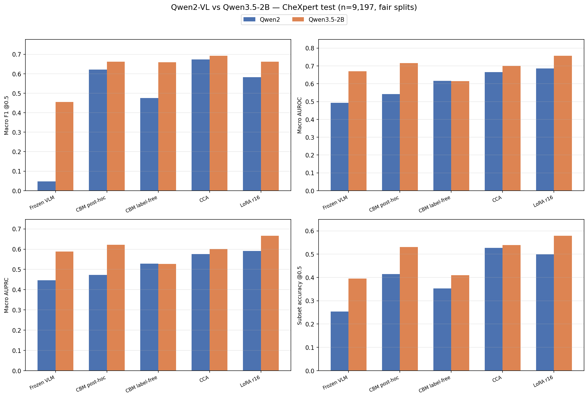
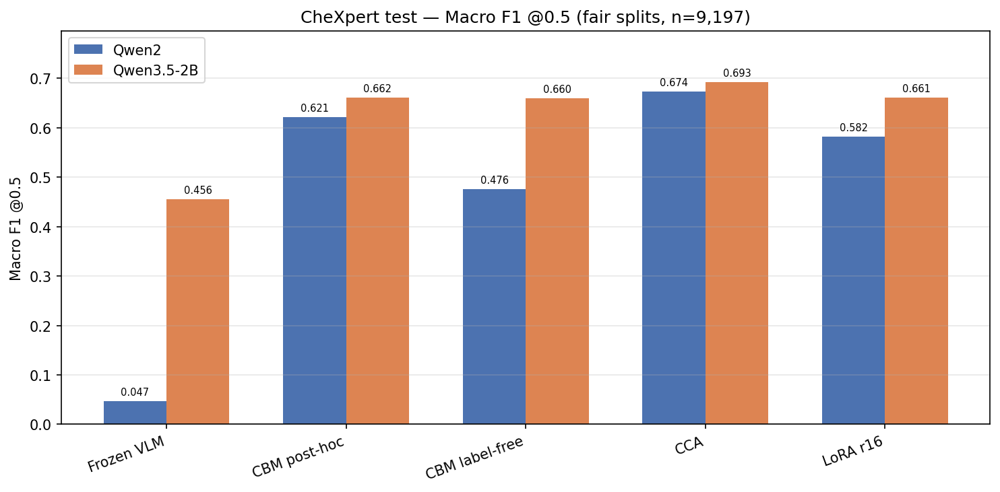

# Qwen2-VL vs Qwen3.5-2B — Summary

Fair head-to-head on **same CheXpert splits** (test n=9,197) and **same NIH 6k** cross-site set. All models trained on CheXpert only; no NIH fine-tuning.

Full report: [`qwen2_vs_qwen35_chexpert.md`](qwen2_vs_qwen35_chexpert.md)

**Status:** All 5 methods complete on both datasets. Qwen3.5 LoRA NIH cross-site verified on **6,000** predictions (`test_rows_n6000.json`).

---

## Test macro F1 @0.5

| Method | CheXpert Qwen2 | CheXpert Qwen3.5 | Δ | NIH Qwen2 | NIH Qwen3.5 | Δ |
|--------|---------------:|-----------------:|--:|----------:|------------:|--:|
| Frozen VLM | 0.047 | **0.456** | +0.41 | 0.059 | **0.147** | +0.09 |
| CBM post-hoc | 0.621 | **0.662** | +0.04 | 0.053 | **0.135** | +0.08 |
| CBM label-free | 0.476 | **0.660** | +0.18 | 0.052 | **0.087** | +0.04 |
| CCA | 0.674 | **0.693** | +0.02 | **0.136** | 0.133 | ~0 |
| LoRA r16 | 0.582 | **0.661** | +0.08 | 0.114 | **0.186** | +0.07 |

**Bold** = better of the two backends for that row.

---

## Test macro AUROC

| Method | CheXpert Qwen2 | CheXpert Qwen3.5 | NIH Qwen2 | NIH Qwen3.5 |
|--------|---------------:|-----------------:|----------:|------------:|
| Frozen VLM | 0.492 | **0.670** | 0.524 | **0.746** |
| CBM post-hoc | 0.542 | **0.716** | 0.489 | **0.653** |
| CBM label-free | **0.616** | 0.614 | 0.539 | **0.553** |
| CCA | 0.666 | **0.701** | **0.633** | 0.630 |
| LoRA r16 | 0.685 | **0.757** | 0.612 | **0.741** |

NIH Qwen3.5 AUROC/AUPRC computed from `test_predictions.json` where not saved in `metrics.json`.

---

## Best method per setting

| Setting | Best Qwen3.5 | F1 | Best Qwen2 | F1 |
|---------|--------------|---:|------------|---:|
| CheXpert in-domain | **CCA** | 0.693 | CCA | 0.674 |
| NIH cross-site | **LoRA** | 0.186 | CCA | 0.136 |

---

## NIH cross-site completion

| Method | Qwen2 run | Qwen3.5 run | n |
|--------|-----------|-------------|--:|
| Frozen VLM | `vlm_zeroshot/nih/crosssite_eval` | `vlm_zeroshot/nih/qwen35_2b_frozen_nih_n6000` | 6000 |
| CBM post-hoc | `cbm_posthoc/nih/crosssite_eval` | `cbm_posthoc/nih/crosssite_eval_qwen35_2b` | 6000 |
| CBM label-free | `cbm_labelfree/nih/crosssite_eval` | `cbm_labelfree/nih/crosssite_eval_qwen35_2b` | 6000 |
| CCA | `cca/nih/crosssite_eval` | `cca/nih/crosssite_eval_qwen35_2b` | 6000 |
| LoRA r16 | `qwen2vl_lora_r16/nih/crosssite_eval` | `qwen35_2b_lora_r16/nih/crosssite_eval_qwen35_2b` | 6000 |

LoRA eval uses `test_rows_n6000.json` (same image paths as Qwen2 LoRA).

---

## Key findings

1. **Qwen3.5 wins CheXpert F1 on every method** — biggest jump on frozen VLM (0.047 → 0.456).
2. **CheXpert best:** Qwen3.5 CCA (0.693) with ~435K params; LoRA close (0.661) but ~25× more params.
3. **NIH best:** Qwen3.5 LoRA (0.186 F1, 0.741 AUROC) — beats CCA and frozen; opposite ranking vs CheXpert.
4. **CCA ~ tied on NIH F1** (0.136 vs 0.133); Qwen3.5 LoRA generalizes cross-site much better than Qwen2 LoRA (+0.072 F1).
5. **Calibration:** Qwen3.5 improves ECE/Brier on most methods; CBM label-free mixed on NIH.

---

## Figures

---

## Data

- CheXpert metrics: [`qwen2_vs_qwen35_chexpert_metrics.json`](qwen2_vs_qwen35_chexpert_metrics.json)
- NIH metrics: [`qwen2_vs_qwen35_nih_metrics.json`](qwen2_vs_qwen35_nih_metrics.json) — refresh: `python scripts/collect_qwen35_nih_metrics.py`
